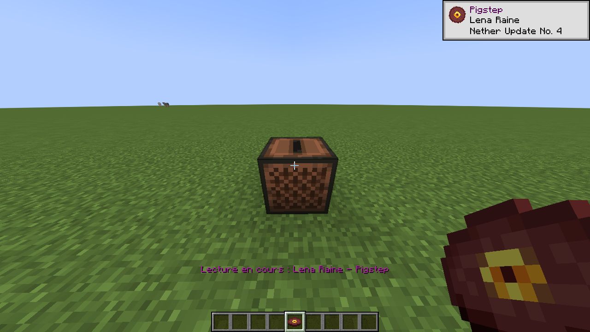
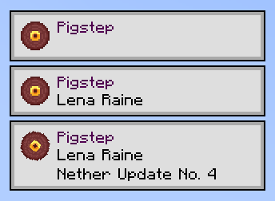
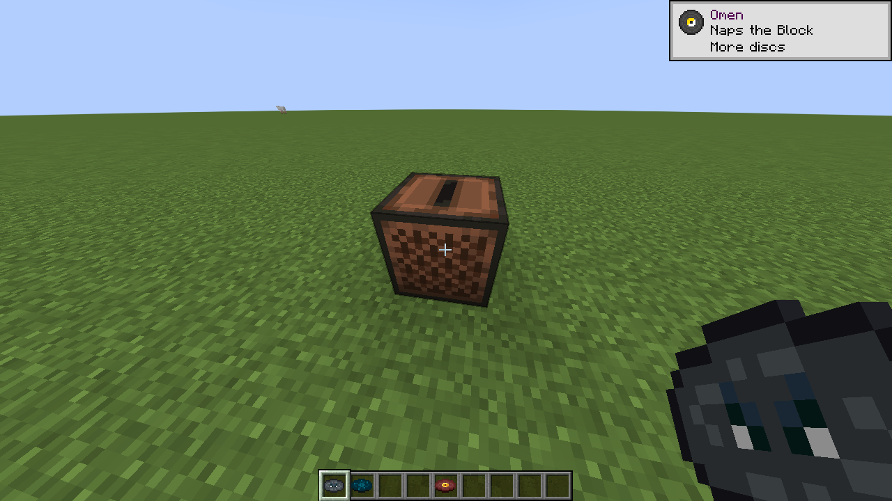
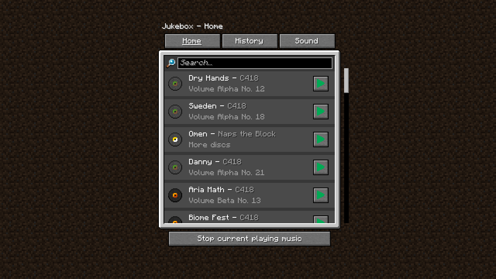
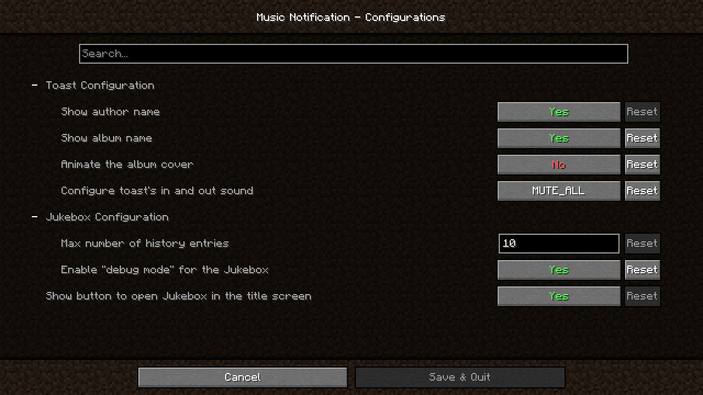

https://docs.neoforged.net/docs/resources/
https://stonecutter.kikugie.dev/

https://github.dev/RaphiMC/ImmediatelyFast
https://github.dev/MrCrayfish/Backpacked/blob/multiloader/1.20.6/common/src/main/java/com/mrcrayfish/backpacked/core/ModCommands.java
https://github.dev/IMB11/Sounds/tree/0.9.0
https://github.dev/Serilum/Omega-Mute

https://docs.minecraftforge.net/en/1.16.x/concepts/registries/
https://docs.minecraftforge.net/en/1.19.x/misc/keymappings/
https://neoforged.net/
https://docs.neoforged.net/docs/resources/

# Music Notification

Adds a toast notification when music is played in the game with the track’s name, author, and album name.

### **Require**: [Cloth Config API](https://modrinth.com/mod/cloth-config)

# 📷 Gallery

    <table>
        <tr>
            <td align="middle">
                
                <figcaption align="middle">From a music disc with "Show album name": true</figcaption>
            </td>
        </tr>
        <tr>
            <td align="middle">
                
                <figcaption align="middle">The 3 different toasts configuration</figcaption>
            </td>
        </tr>
        <tr>
            <td align="middle">
                
                <figcaption align="middle">Works with modded cds</figcaption> 
            </td>
        </tr> 
        <tr>
            <td align="middle">
                
                <figcaption align="middle">Play any music anytime and anywhere</figcaption> 
            </td>
        </tr>
    </table>

# ⚙ Settings

# Video Preview

https://youtu.be/HK2swFtPanA

# Customization

To add support for custom music or customize existing tracks you need to add a file named `musics.json` inside custom resource pack under the namespace `musicnotification`.

JSON Schema can be found here: [DOCS.md](./DOCS.md)  
If you have any question, feel free to fill an issue.

# Compatibility issues

- Better Recipe Mod
  - You will not be able to configure the toast sound mute setting

# Contributor

Discs icon are made by [YaCCBoy](https://github.com/YaCCBoy)  
Mod icon was made by [akairoo](https://dribbble.com/akairoo)  
Simplified Chinese translation by [Chiloven945](https://github.com/Chiloven945)
