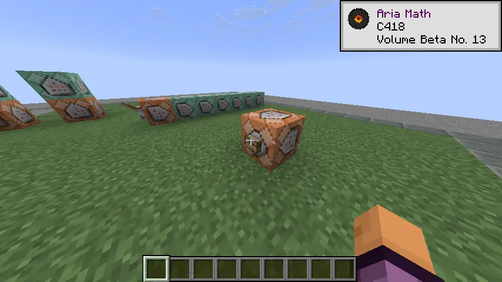
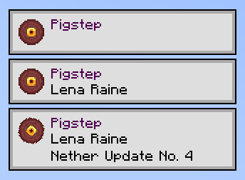
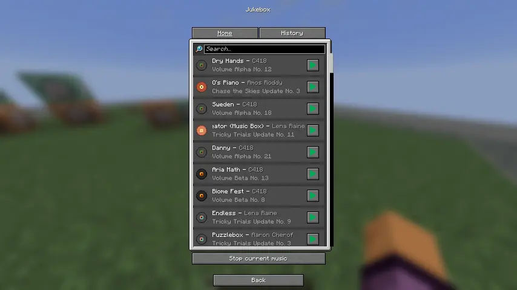
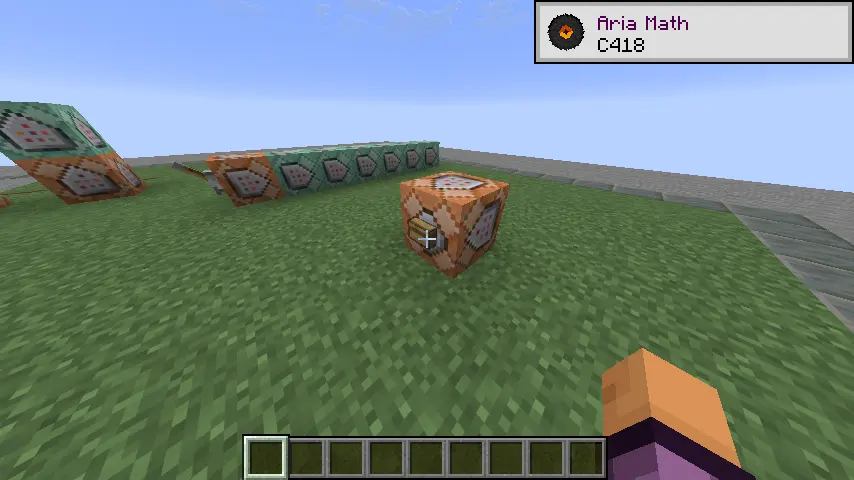
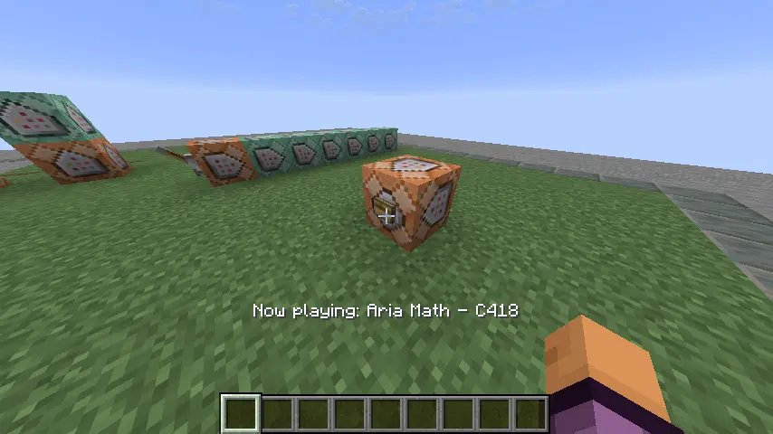
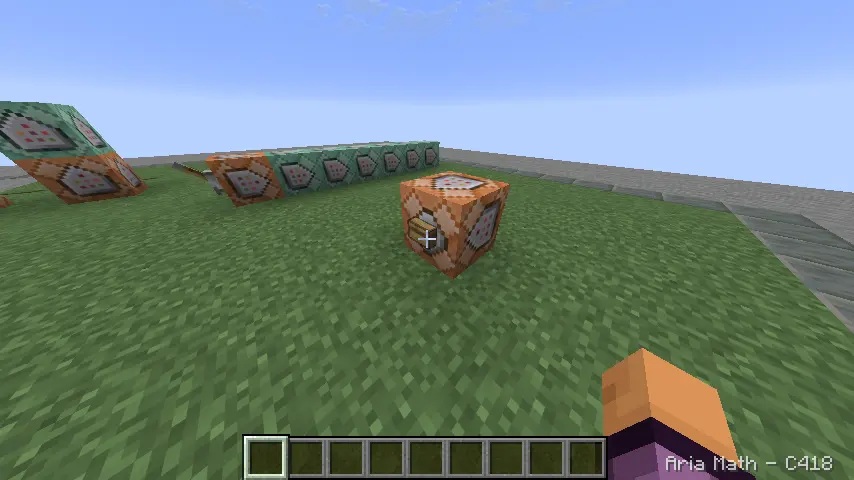
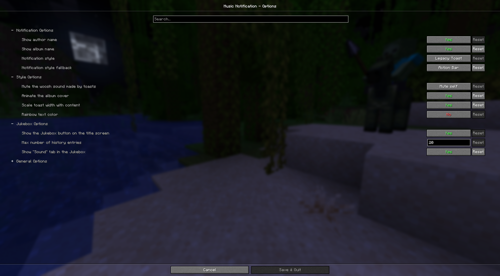

# Music Notification

Adds a toast notification when music is played in the game with the track’s name, author, and album name.

### **Require**: [Cloth Config API](https://modrinth.com/mod/cloth-config)

# 📷 Gallery

    <table>
        <tr>
            <td align="middle">
                
                <figcaption align="middle">with "Show album name": true</figcaption>
            </td>
        </tr>
        <tr>
			 <td align="middle">
				 
				 <figcaption align="middle">Different toast configuration</figcaption>
			</td>
   		</tr>
		<tr>
            <td align="middle">
                
                <figcaption align="middle">Play any music anytime and anywhere</figcaption>
            </td>
		</tr>
    </table>

## Notification Styles

    <table>
        <tr>
            <td align="middle">
                
                <figcaption align="middle">Toast</figcaption>
            </td>
        </tr>
        <tr>
            <td align="middle">
                
                <figcaption align="middle">Action Bar</figcaption>
            </td>
        </tr>
        <tr>
            <td align="middle">
                
                <figcaption align="middle">Compact</figcaption>
            </td>
        </tr>
    </table>

# ⚙ Settings

# Video Preview

<https://youtu.be/HK2swFtPanA>

# Customization

To add support for custom music or customize existing tracks you need to add a file named `musics.json` inside custom
resource pack under the namespace `musicnotification`.

JSON Schema can be found here: [DOCS.md](./DOCS.md)  
If you have any question, feel free to fill an issue.

# Contributor

Discs icon are made by [carotteatomique](https://github.com/carotteatomique)  
Mod icon was made by [akairoo](https://dribbble.com/akairoo)  
Simplified Chinese translation by [Chiloven945](https://github.com/Chiloven945)
